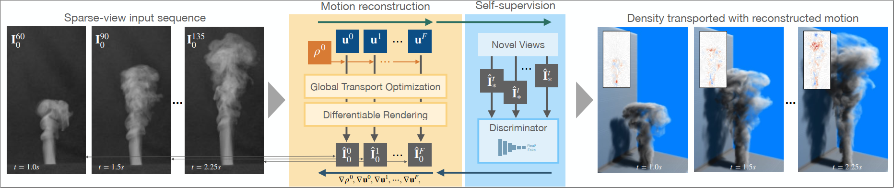

# Global Transport for Fluid Reconstruction with Learned Self-Supervision

This repository is the official implementation of [Global Transport for Fluid Reconstruction with Learned Self-Supervision](https://openaccess.thecvf.com/content/CVPR2021/html/Franz_Global_Transport_for_Fluid_Reconstruction_With_Learned_Self-Supervision_CVPR_2021_paper.html) ([Project Website](https://ge.in.tum.de/publications/2021-franz-globtrans/), [arXiv](https://arxiv.org/abs/2104.06031)). 

  
*Abstract*  
We propose a novel method to reconstruct volumetric flows from sparse views via a global transport formulation. Instead of obtaining the space-time function of the observations, we reconstruct its motion based on a single initial state. In addition we introduce a learned self-supervision that constrains observations from unseen angles. These visual constraints are coupled via the transport constraints and a differentiable rendering step to arrive at a robust end-to-end reconstruction algorithm. This makes the reconstruction of highly realistic flow motions possible, even from only a single input view. We show with a variety of synthetic and real flows that the proposed global reconstruction of the transport process yields an improved reconstruction of the fluid motion.

## Requirements
- A Linux system with a Cuda-capable GPU
- CUDA 9
- Python 3.6, with packages:
	- numpy 1.17.2
	- Tensorflow-GPU v1.12
	- munch 2.5.0
	- imageio 2.6.0 (with its freeimage binary)
- We include parts of the [CUDA Samples](https://github.com/NVIDIA/cuda-samples)
- We include [OpenGL Mathematics](https://glm.g-truc.net/0.9.9/index.html) [v.  0.9.9.6](https://github.com/g-truc/glm/tree/0.9.9.6) (GLM), MIT license

## Installation

- Install [CUDA](https://docs.nvidia.com/cuda/cuda-installation-guide-linux/index.html) version 9 (we use 9.2)
- Install Python and setup the environment via [conda](https://docs.conda.io/en/latest/miniconda.html):
	```
	conda env create -f conda_env_GlobalFlowRecon.yml
	```
- Compile the rendering and advection kernels (requires `g++` and `nvcc` compilers):
	```
	python compile.py
	```
- If the 'freeimage' binaries for imageio are not available on your system [download them from Github](https://github.com/imageio/imageio-binaries) OR run
	```
	imageio_download_bin freeimage
	```

## Reconstruction

To reconstruct the final results of the paper, run this command:
- For a small example multi-view reconstruction run the following command, the data is already provided in the repository:
	```
	python reconstruct_sequence.py --setup "configs/mv_globt_small.json" --fit --deviceID 0
	```
- For the full sequence multi-view reconstruction example you will need all inputs of the first reconstruction of the [ScalarFlow dataset](https://ge.in.tum.de/publications/2019-scalarflow-eckert/) in `./data`.
	```
	python reconstruct_sequence.py --setup "configs/mv_globt.json" --fit --deviceID 0
	```
- For the small and full sequence single-view reconstruction you need the inputs of the first 7 [ScalarFlow reconstructions](https://ge.in.tum.de/publications/2019-scalarflow-eckert/) as training-data for the discriminator.
	```
	python reconstruct_sequence.py --setup "configs/sv_globt_disc_small.json" --fit --deviceID 0
	python reconstruct_sequence.py --setup "configs/sv_globt_disc.json" --fit --deviceID 0
	```

You can disable console output with the `-c` option.

## Evaluation

Basic evaluation and rendering of the reconstruction is done automatically at the end of the reconstruction procedure.  
To further evaluate, take a look here:
```
python eval_runs.py -h
```

## Results

  
Left: multi-view, right: single-view.

## Citation
```
@InProceedings{Franz_2021_CVPR,
    author    = {Franz, Erik and Solenthaler, Barbara and Thuerey, Nils},
    title     = {Global Transport for Fluid Reconstruction With Learned Self-Supervision},
    booktitle = {Proceedings of the IEEE/CVF Conference on Computer Vision and Pattern Recognition (CVPR)},
    month     = {June},
    year      = {2021},
    pages     = {1632-1642}
}
```

## Acknowledgements
This work was supported by the Siemens/IAS Fellowship *Digital Twin*, and the ERC Consolidator Grant *SpaTe* (CoG-2019-863850).
